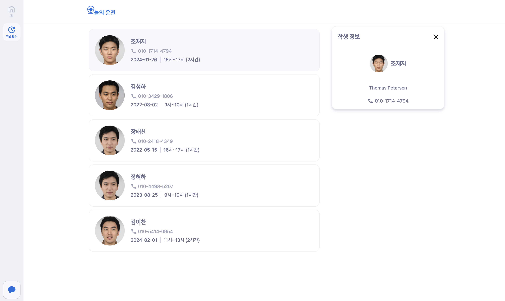

# 오늘의 운전 (Driving Today)

## 팀원 소개

|                                                                                       오정진                                                                                       |                                                                                      홍정희                                                                                       |                                                                                      이지수                                                                                       |                                                                                        서지원                                                                                        |                                                                                       김준희                                                                                       |
| :--------------------------------------------------------------------------------------------------------------------------------------------------------------------------------: | :-------------------------------------------------------------------------------------------------------------------------------------------------------------------------------: | :-------------------------------------------------------------------------------------------------------------------------------------------------------------------------------: | :----------------------------------------------------------------------------------------------------------------------------------------------------------------------------------: | :--------------------------------------------------------------------------------------------------------------------------------------------------------------------------------: |
| <a href='https://github.com/ojj1123'></a> | <a href='https://github.com/junhea'></a> | <a href='https://github.com/jsLeen'></a> | <a href='https://github.com/seojeewon'></a> | <a href='https://github.com/zensen6'></a> |
|                                                                                      frontend                                                                                      |                                                                                     frontend                                                                                      |                                                                                      backend                                                                                      |                                                                                       backend                                                                                        |                                                                                      backend                                                                                       |
|                                                                 <a href='https://github.com/ojj1123'>@ojj1123</a>                                                                  |                                                                  <a href='https://github.com/junhea'>@junhea</a>                                                                  |                                                                  <a href='https://github.com/jsLeen'>@jsLeen</a>                                                                  |                                                                <a href='https://github.com/seojeewon'>@seojeewon</a>                                                                 |                                                                 <a href='https://github.com/zensen6'>@zensen6</a>                                                                  |

## 프로젝트 개요

오늘의 운전(Driving Today)은 운전 연수 학원 강사에 대한 정보 불균형을 해소하고자 합니다. 기존에는 운전학원을 등록하기 전 주변인의 후기에 의존하였고, 운전학원마다 상이한 가격과 연수 시간을 비교하기 어려웠습니다. 이를 해소하고자 운전 학원 강사 개개인별 정보와 사용자 리뷰를 통해 운전 학원 강사에 대한 정보를 제공해줍니다.

## 핵심 기능

### (학생) 예정된 운전 연수

| 학생 대시 보드(연수 예약 전)  |      학생 대시 보드(연수 예약 후)      |
| :---------------------------: | :------------------------------------: |
|  |  |

- 운전 연수 예약 상태를 확인할 수 있습니다.
- 운전 연수 내역을 캘린더뷰를 통해 확인할 수 있습니다.

### (학생) 운전 연수 예약

|  내 위치 주변 학원 강사 검색   | 내 위치 주변 운전 강사 리스트  |
| :----------------------------: | :----------------------------: |
|  |  |

#### 내 위치 주변 학원 강사 검색

- 원하는 날짜, 시간, 연수 시간을 기준으로 검색할 내 위치 주변 학원 강사를 검색합니다.
- 날짜 선택을 위해 캘린더 뷰를 직접 구현하였습니다.

#### 내 위치 주변 운전 강사 리스트

- 내 위치 주변 운전 강사 리스트를 보여줍니다.
- 무한 스크롤을 통해 운전 강사 리스트를 확인합니다.
- 지도를 움직일 경우 지도의 중심 위치를 기반으로 재검색합니다.
- 강사 리스트의 강사 클릭 혹은 지도의 마커 클릭 시 강사 이름, 평점, 학원 위치, 강사 소개, 리뷰를 확인합니다.
- 문의 버튼 클릭 시 강사와 1:1 대화를 할 수 있습니다.
- 예약 버튼 클릭 시 결제 페이지로 이동합니다.

| 운전 연수 예약 및 결제 페이지  |    예약 및 결제 완료 페이지    |
| :----------------------------: | :----------------------------: |
|  |  |

#### 운전 연수 예약 및 결제

- 운전 연수 예약 정보를 확인할 수 있습니다.
- 결제 방식을 선택한 후 연수 예약을 등록할 수 있습니다.
- 결제 후 결제 완료 페이지에서 연수 예약 정보를 확인할 수 있습니다.

### (학생) 운전 연수 예약 내역 관리

|         운전 연수 예약         |      운전 강사 리뷰 작성       |
| :----------------------------: | :----------------------------: |
|  |  |

- 운전 연수 내역 페이지에서 예정, 완료된 내역을 확인할 수 있습니다.
- 운전 강사에 대한 리뷰를 작성합니다.

### 운전 강사와 학생 간 문의 채팅

|       학생 측 채팅        |        강사측 채팅        |
| :-----------------------: | :-----------------------: |
|  |  |

- 문의 클릭 시 강사와 1:1 대화를 진행합니다.
- 연수 학생이 문의 클릭 시 채팅방이 생성됩니다.
- 채팅방 입장 시 socket 이 연결됩니다.

### (강사) 운전 연수 예약 내역 관리

|           대시보드            |          지난 연수 내역           |
| :---------------------------: | :-------------------------------: |
|  |  |

- 학생이 연수를 신청하면 대시보드 페이지에서 등록된 연수 예약 내역을 확인합니다.
- 지난 연수 내역에서 연수 받은 학생의 정보를 확인할 수 있습니다.

## 개발 환경 세팅

> 환경변수 파일 예시는 각 직군 폴더에서 확인할 수 있습니다.
>
> 백엔드 환경변수는 `/backend/driving-today` 폴더 내 `example.application.yml` 에서 확인할 수 있습니다.
>
> 프론트엔드 환경변수는 `/frontend` 폴너 내 `.env.example` 에서 확인할 수 있습니다.

### 백엔드

```shell
cd backend/driving-today
sudo chmod +x gradlew
./gradlew clean build
cd build/libs
java -jar *-SNAPSHOT.jar
```

### 프론트엔드

```shell
cd frontend
pnpm install
pnpm dev
```

## 기술스택

### 백엔드

- 언어 : Java
- 프레임워크 : Spring boot
- DB : MySQL, MongoDB, radis
- ORM : Spring Data JPA
- 인프라 : AWS EC2, ELB, Route53, S3

### 프론트엔드

- 언어: Typescript
- 라이브러리: React18, react-router-dom, emotion
- 번들러: Vite
- 코드 검사 도구: ESLint, Prettier
- 인프라: AWS S3, CloudFront, Route53

## 인프라 및 아키텍처


## 프로젝트 문서 모음

[Wiki 페이지](https://github.com/softeerbootcamp-3rd/Team1-driving-today/wiki)에서 프로젝트 문서를 확인할 수 있습니다.
